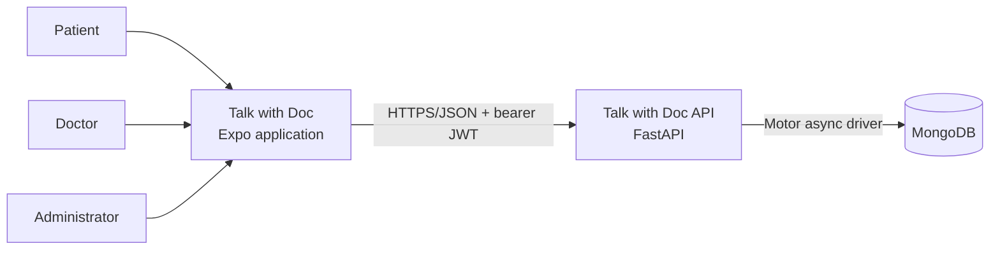
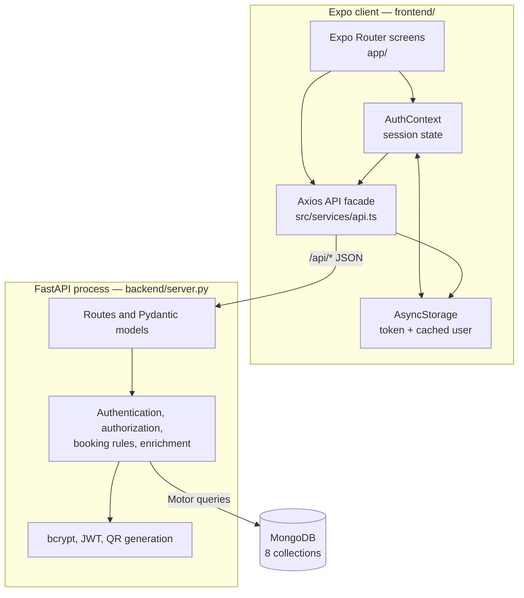
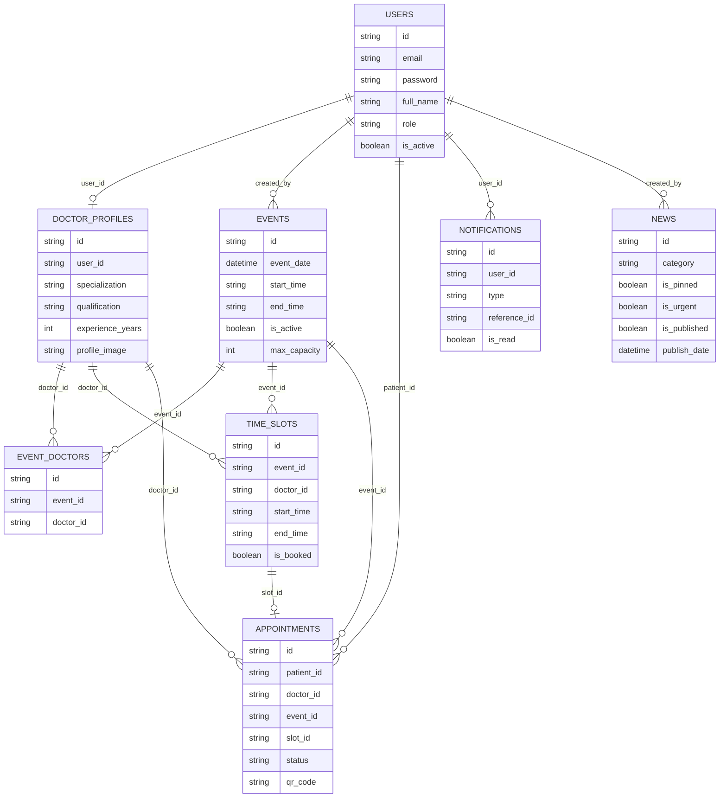
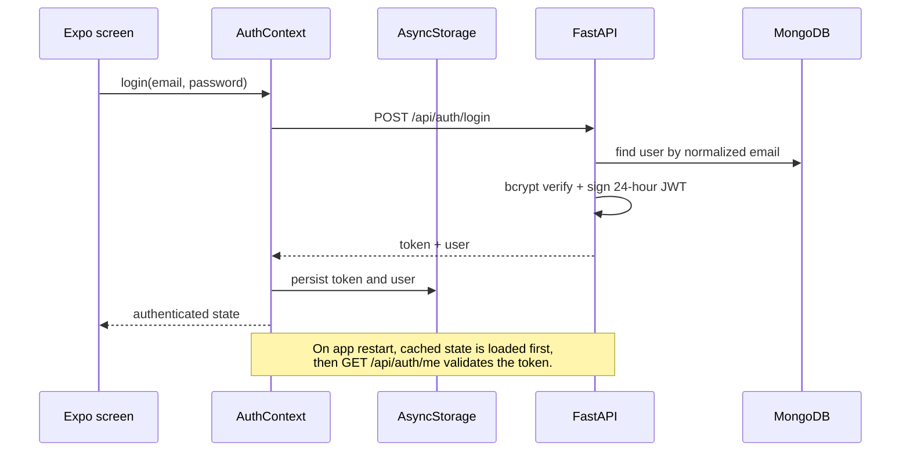
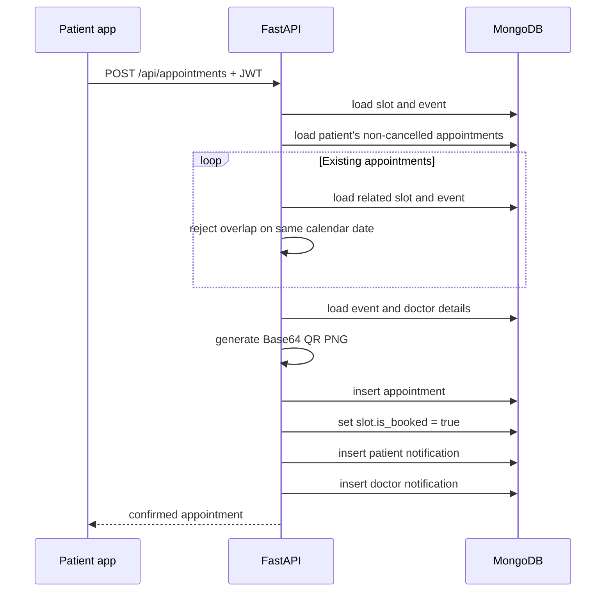

# Talk with Doc Architecture

## 1. Purpose and scope

Talk with Doc coordinates health-screening events. It supports three roles:

- **Patient** — browse events and news, choose an assigned doctor and available slot, book or cancel an appointment, and present its QR code.
- **Doctor** — maintain a professional profile, join events, create slots, view appointments, scan appointment QR codes, and complete consultations.
- **Administrator** — manage events, assignments, users, doctors, appointments, and news, and view aggregate statistics.

This document describes the architecture implemented in this repository as of 2026-06-21. It distinguishes current behavior from recommended future work.

## 2. System context



The system has no third-party runtime integration in the current code. Maps and Waze values are stored as URLs, images are embedded as Base64 strings, QR codes are generated inside the API, and notifications are in-app MongoDB records rather than push notifications.

## 3. Container view



### 3.1 Frontend

The frontend is an Expo 54 / React Native 0.81 application using file-based Expo Router navigation.

- `app/_layout.tsx` installs the global `AuthProvider` and root stack.
- `app/index.tsx` redirects to authentication or the tab shell after session loading.
- `app/(tabs)/` contains Events, Appointments, Notifications, and Profile.
- Detail and workflow routes live under `event/`, `doctor/`, `booking/`, `appointment/`, and `news/`.
- Administrative screens live under `app/admin/`.
- `src/context/AuthContext.tsx` owns the in-memory user/token state and persists it in AsyncStorage.
- `src/services/api.ts` is the client boundary. Its Axios request interceptor attaches the bearer token; its response interceptor clears stored credentials after any HTTP 401.
- `src/types/index.ts` defines client-side representations of API resources. These are manually maintained and are not generated from OpenAPI.

Screens fetch their own data and keep local component state. There is no shared server-state cache, offline synchronization layer, or global domain store despite Zustand being listed as a dependency.

### 3.2 Backend

The backend is a single-module FastAPI application in `backend/server.py`.

The module contains:

- Pydantic request and response models;
- password hashing and JWT helpers;
- route handlers and inline role checks;
- booking and overlap rules;
- response enrichment queries;
- QR image generation;
- notification record creation; and
- direct MongoDB access through Motor.

All routes are mounted below `/api`. FastAPI supplies `/docs` and `/openapi.json` outside that prefix. CORS middleware currently accepts every origin.

There is no internal controller/service/repository separation. Route handlers are therefore both the HTTP boundary and the application/domain layer.

### 3.3 Persistence

MongoDB is selected from `MONGO_URL` and optional `DB_NAME` (default `talkwithdoc_db`). The application uses UUID strings as public `id` fields while MongoDB also creates internal `_id` values.

No migrations, collection validators, explicit indexes, or startup seed process are present. Relationships are application-managed references rather than database-enforced foreign keys.

## 4. Data model



The eight physical collections are `users`, `doctor_profiles`, `events`, `event_doctors`, `time_slots`, `appointments`, `notifications`, and `news`.

Notable denormalization:

- appointment list/detail responses join event, slot, doctor profile, and doctor user data in application code;
- doctor responses join profile and user data;
- appointment QR PNGs, profile images, event banners, and news thumbnails are stored as Base64 text in MongoDB;
- `time_slots.is_booked` duplicates appointment occupancy state for fast availability filtering.

## 5. API and authorization boundaries

| Area | Public reads | Authenticated behavior | Restricted writes |
| --- | --- | --- | --- |
| Authentication | Register, login | Read own user | — |
| Events | List/detail, assigned doctors | Doctor assignment status | Admin CRUD/assignment; doctor self-join |
| Doctors | List/detail | Doctor profile CRUD | Admin doctor CRUD |
| Slots | List by event/doctor | Doctor creates/deletes slots | Admin is accepted by delete; bulk-create currently rejects admin because no doctor ID can be supplied |
| Appointments | — | Role-filtered list/detail | Patient books/cancels; doctor verifies/completes; admin manages status/deletion |
| Notifications | — | User reads/marks own notifications | Created internally by application workflows |
| News | List/detail | — | Admin CRUD |
| Administration | — | — | Admin users, doctors, appointments, and stats |

Authorization is enforced inside individual route handlers using the role stored on the MongoDB user document. The JWT also contains a role claim, but `get_current_user` reloads the user and handlers rely on the database value.

## 6. Key runtime flows

### 6.1 Login and session restoration



Passwords are hashed with bcrypt. JWTs use HS256 and expire after 24 hours. There is no refresh-token or server-side session/revocation mechanism; deactivating or deleting a user prevents subsequent authenticated requests because each request reloads the user.

### 6.2 Appointment booking



Overlap uses lexicographic `HH:MM` comparison and the rule `new_start < existing_end && existing_start < new_end`, scoped to the same event date. Cancelling frees the slot. The write sequence is not transactional or atomic, so concurrent requests can race for one slot and partial failure can leave appointment and slot state inconsistent.

### 6.3 QR verification

The appointment QR contains JSON with the appointment ID plus display data. The doctor scanner parses the ID, calls `POST /api/appointments/verify`, displays the server response, and can then call the completion endpoint. The QR is an identifier carrier, not a signed credential; server-side authorization and appointment lookup remain the trust boundary.

### 6.4 News and notifications

Published news reads are public. Listing supports category and text search and applies server-side date and sort rules. Reading one article increments its view count. Publishing urgent news creates a notification for every active user. Other notifications are generated for event assignment, appointment booking/cancellation, and administrative status changes.

Notifications are pull-based. The app reads the notification collection when the screen opens or refreshes; there is no background worker, email/SMS delivery, or mobile push provider.

## 7. Runtime configuration and deployment

| Variable | Consumer | Required | Purpose |
| --- | --- | --- | --- |
| `MONGO_URL` | Backend | Yes | MongoDB connection string; startup fails if absent |
| `DB_NAME` | Backend | No | Database name; defaults to `talkwithdoc_db` |
| `JWT_SECRET` | Backend | Operationally yes | HS256 signing secret; code has an unsafe development fallback |
| `EXPO_PUBLIC_BACKEND_URL` | Frontend | No | API origin; defaults to `http://localhost:8001` |

The repository does not include Docker, infrastructure-as-code, CI, production process configuration, or environment templates. A deployment must provide MongoDB, run the ASGI app, publish the API over HTTPS, configure a reachable frontend API URL, and manage secrets externally.

Images stored in JSON can make requests and MongoDB documents large. MongoDB's 16 MiB document limit applies; production deployments should enforce upload limits and normally move media to object storage.

## 8. Testing and observability

The repository includes Python integration scripts that call a previously hosted API and historical results in `test_result.md`. They exercise authentication, role access, events, doctor profiles, slots, appointments, overlap behavior, and news. They are not isolated unit tests: they depend on remote state and fixed test credentials.

The frontend exposes only the Expo lint script. No frontend component/end-to-end tests, backend CI workflow, coverage gate, or local MongoDB test fixture is present.

Backend observability consists of Python logging configuration and the unauthenticated `GET /api/health` endpoint. There are no structured request logs, metrics, traces, audit log, or database health check in that endpoint.

## 9. Current constraints and risks

These items are architectural characteristics of the current implementation and the main priorities before production use:

1. **Self-assigned privilege:** public registration accepts a caller-supplied role, including `admin`. Registration should force `patient`; privileged roles should be granted through a protected workflow.
2. **Development security defaults:** the JWT secret has a known fallback and CORS allows all origins while credentials are enabled. Production startup should reject missing secrets and use an explicit origin allowlist.
3. **Non-atomic booking:** appointment insertion and slot occupancy updates are separate operations without a unique constraint or transaction. Use a conditional atomic claim and suitable unique indexes, optionally in a MongoDB transaction.
4. **Incomplete ownership checks:** some doctor actions verify only the doctor role, not that the appointment/slot belongs to that doctor; slot deletion similarly lacks owner checks. Centralize authorization policies and test object-level access.
5. **Client-supplied relation IDs:** booking does not fully prove that submitted event, doctor, and slot IDs all describe the same assignment. Derive event/doctor from the selected slot or validate every relationship server-side.
6. **Application-side joins:** list endpoints issue repeated MongoDB queries per result (N+1 pattern). Aggregation pipelines or batched lookups will scale more predictably.
7. **No enforced schema or indexes:** uniqueness and referential assumptions live in code. At minimum, index user email, public IDs, assignment pairs, slot lookup fields, appointment ownership/status, notification ownership/date, and news publication fields.
8. **Single large backend module:** transport, policy, domain logic, and persistence are coupled in one file. As features grow, split by domain while retaining one deployable service unless scaling needs justify more processes.
9. **Contract drift risk:** frontend TypeScript interfaces and API calls are handwritten independently of Pydantic models. Generate a typed client from FastAPI OpenAPI or add contract tests.
10. **Externalized test history:** current integration scripts target a remote hostname and fixed accounts. Add hermetic tests against an ephemeral test database and a CI pipeline.
11. **Broken client references:** the Events screen links to `/news-list`, but that route is absent, and `app.json` references a missing `assets/images/splash-icon.png`. Add the route/asset or remove the references before producing an app build.

## 10. Recommended evolution

Keep the current modular-monolith deployment shape, but introduce internal boundaries before considering microservices:

```text
backend/
  app/
    api/          # FastAPI routers and HTTP schemas
    domain/       # booking, event, identity, news rules
    services/     # workflow orchestration and authorization
    repositories/ # MongoDB queries and atomic writes
    core/         # settings, security, logging
```

The practical sequence is:

1. close privilege and object-authorization gaps;
2. make booking atomic and add indexes;
3. add settings validation, environment examples, and deployable infrastructure;
4. establish isolated backend and frontend tests in CI;
5. extract backend modules and generate the frontend API client;
6. move media to object storage and add push notifications only when product needs require them.

This preserves the simplicity of one API and one database while creating clean seams for future scale.
